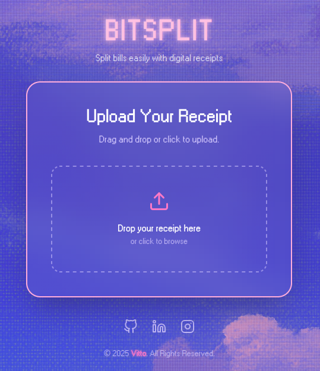
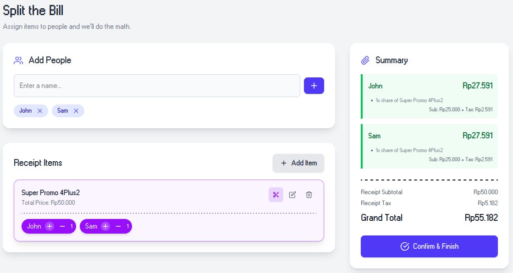
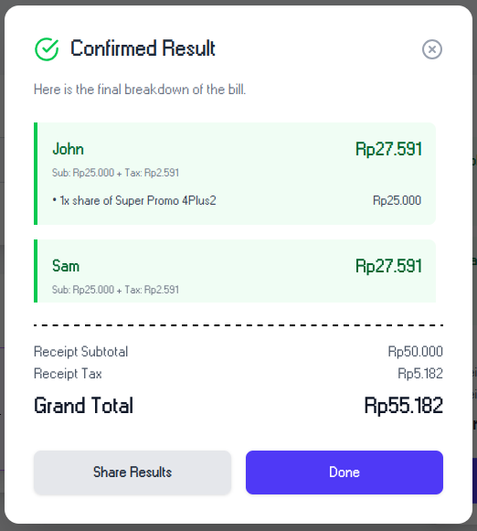

# BITSPLIT
Bill Splitting app that utilize various resource from Microsoft Azure

**IMPORTANT!!** If you want to run this app locally, please refer to the local development friendly repo [here](https://github.com/Tosaagi/BITSPLIT-Local.git)

## What is BITSPLIT?

BITSPLIT is a modern web application designed to effortlessly split bills among a group of people. It eliminates the manual effort of calculating who owes what by using Artificial Intelligence to automatically read and process information from a receipt.

## Core Features
- **AI-Powered Receipt Scanning**: Upload a photo of a receipt, and the app's Document Intelligence will automatically extract individual items details, like their names, prices, tax, and the total amount.
- **Simple Item Assignment**: Easily assign each item on the receipt to the person or people who ordered it. The app supports shared items and splits the cost accordingly.
- **Real-Time Calculations**: Live summary updates as you edit to show exactly how much each person owes, including their proportional share of the tax.
- **Clear Final Summary**: Once all items are assigned, the app presents a clean, final breakdown of the total amount owed by each person.

## How It Works (User Flow)
1. **Upload**: The user starts by dragging and dropping or selecting an image file of their receipt.
2. **Analyze**: The application securely uploads the image and uses a powerful AI service (Azure Document Intelligence) to analyze the content, identifying all line items, prices, and totals.
3. **Assign**: The user is presented with a list of the extracted items. They can add the names of the people in their group and then assign each item.
4. **Confirm**: After all items are assigned, the user can view and confirm the final, calculated breakdown of the bill.

## Technical Overview
- **Frontend (User Interface)**: Built with React, creating a responsive and interactive user experience.
- **Backend (Server Logic)**: Powered by serverless Azure Functions, which handle file uploads and the AI analysis pipeline.

- **AI & Data Storage**:
    - **Azure Document Intelligence**: The core AI service used for receipt analysis.
    - **Azure Blob Storage**: Securely stores the uploaded receipt images.
    - **Azure Table Storage**: Stores the structured data extracted from the receipts.

## Images

